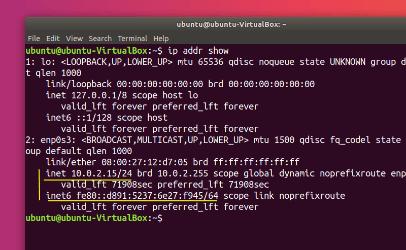

# Strech Installation Instructions on Local Ubuntu 20.04 Machine

## Install ROS
[Reference Instructions](http://wiki.ros.org/noetic/Installation/Ubuntu)

### Setup `sources.list`
```bash
sudo sh -c 'echo "deb http://packages.ros.org/ros/ubuntu $(lsb_release -sc) main" > /etc/apt/sources.list.d/ros-latest.list'
```

### Set up apt keys
```bash
sudo apt install curl # if you haven't already installed curl
curl -s https://raw.githubusercontent.com/ros/rosdistro/master/ros.asc | sudo apt-key add -
```

### Installation
Make sure computer is up to date
```bash
sudo apt update
```
Install ROS full
```bash
sudo apt install ros-noetic-desktop-full
```
Source ROS installation in `~/.bashrc`
```bash
echo "source /opt/ros/noetic/setup.bash" >> ~/.bashrc
source ~/.bashrc
```

## Configure ROS with Stretch using remote master
[Reference](https://docs.hello-robot.com/untethered_operation/#ros-remote-master)
### Find IP address of robot and computer
Both the robot and the user computer must be on the same network for this to work, and they must be able to directly ping each other. It's recommended that the robot has a static ip address to make this process easier. 

To test if the host and the robot can contact each other:
```bash
ping robot-ip-address
```

You can find the command of the current machine by running the following command:
```bash
ip addr show
```


The inet IPv4 address is the one we're interested in. The first 3 numbers of this (`10.0.2`, from the image example) should be the same in both the robot and the user computer. 

Once you have these IP addresses, add the following to your `~/.bashrc`
```bash
echo "export ROS_IP=computer-ip-address" >> ~/.bashrc
echo "export ROS_MASTER_URI=http://robot-ip-address:11311" >> ~/.bashrc
source ~/.bashrc
```

### Setting up SSH
The default command to ssh into the robot is:
```bash
ssh -X username@stretch-ip
```
Replace `stretch-ip` with the ip address of the robot, and `username` with the username used to log on to stretch with. 

However, we can make this a bit easier on us by doing a little bit of configuring. 

First, make sure the ssh key is generated (select the default option if prompted)
```bash
ssh-keygen
```

Then, configure the `~/.ssh/config` file to have the following content:
```bash
Host stretch
    HostName stretch-ip
    User username
    ForwardX11 yes
```
Replace `stretch-ip` with the ip address of the robot, and `username` with the username used to log on to stretch with. 

This will now allow us to ssh into strech with the simple command 
```bash
ssh stretch
```
Furthermore, we can remove the password prompt by running the following command
```bash
ssh-copy-id stretch
```

### Visualizing remotely with RViz
First, we need to get the `strech-user` directory onto the user computer.
```bash
scp -r strech:~/stretch-user ~/stretch-user
```
Then, clone the `stretch-install` repository and run the `stretch_ros_workspace.sh` script
```bash
cd ~/
git clone https://github.com/hello-robot/stretch_install.git
cd stretch_install
git checkout dev/install_20.04
./stretch_create_ros_workspace.sh
```

## Conclusion
This should be everything you need to set up your local Ubuntu 20.04 machine to work with Stretch!